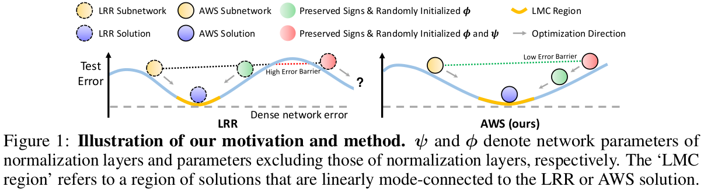

# Find A Winning Sign: Sign Is All We Need To Win the Lottery
#### Junghun Oh, Sunyong Baik, and Kyoung Mu Lee

Official Pytorch implementation of **"Find A Winning Sign: Sign Is All We Need To Win the Lottery"** accepted at **ICLR2025**.
[Paper](https://arxiv.org/abs/2504.05357)

If you find this repo useful for your research, please consider citing our paper:
```
@InProceedings{oh2025find,
  author = {Oh, Junghun and Baik, Sungyong and Lee, Kyoung Mu},
  title = {Find A Winning Sign: Sign Is All We Need To Win the Lottery},
  booktitle = {International Conference on Learning Representations (ICLR)},
  year = {2025}
}
```

## Abstract
The Lottery Ticket Hypothesis (LTH) posits the existence of a sparse subnetwork (a.k.a. winning ticket) that can generalize comparably to its over-parameterized counterpart when trained from scratch. The common approach to finding a winning ticket is to preserve the original strong generalization through Iterative Pruning (IP) and transfer information useful for achieving the learned generalization by applying the resulting sparse mask to an untrained network. However, existing IP methods still struggle to generalize their observations beyond ad-hoc initialization and small-scale architectures or datasets, or they bypass these challenges by applying their mask to trained weights instead of initialized ones. In this paper, we demonstrate that the parameter sign configuration plays a crucial role in conveying useful information for generalization to any randomly initialized network. Through linear mode connectivity analysis, we observe that a sparse network trained by an existing IP method can retain its basin of attraction if its parameter signs and normalization layer parameters are preserved. To take a step closer to finding a winning ticket, we alleviate the reliance on normalization layer parameters by preventing high error barriers along the linear path between the sparse network trained by our method and its counterpart with initialized normalization layer parameters. Interestingly, across various architectures and datasets, we observe that any randomly initialized network can be optimized to exhibit low error barriers along the linear path to the sparse network trained by our method by inheriting its sparsity and parameter sign information, potentially achieving performance comparable to the original.

## CLOSER



For detailed descriptions on the proposed method and experimental results, please refer to the paper.

## Datasets
### CIFAR100
Will be downloaded by running the code
### Tiny-ImageNet
```bash
wget http://cs231n.stanford.edu/tiny-imagenet-200.zip
unzip tiny-imagenet-200.zip
mv tiny-imagenet-200 ./data
python data/preprocess_tiny_imagenet.py
```

## Experiments
Run the bash files as follow:
```bash
bash script/cifar100_efficientnet_lrr.sh # experiments on CIFAR100 with EfficientNet using LRR
bash script/cifar100_efficientnet_aws.sh # experiments on CIFAR100 with EfficientNet using AWS
```

You can analyze linear mode connectivity or SGD noise stability of the trained models by running  ```bash script/calculate_error_barrier.sh```
Please refer to the intruction in the bash file.


## Acknowledgment
We reference the following repositories:
- [fscil](https://github.com/xyutao/fscil)